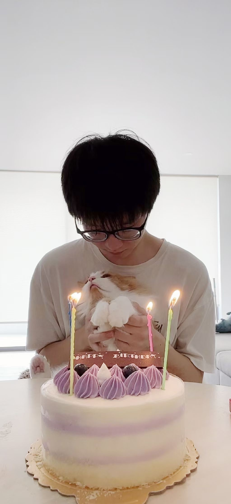

# About me

Warm welcome and hello!
I am a final-year BE student major in electrical engineering (Hons)- based at the University of Queensland. 
I was born in China, and I have been staying in different cities during different stages of my life. Thus I embrace different cultures and strengthen myself in places where I used to live.

Please feel free to follow me on [LinkedIn](https://www.linkedin.com/in/kuang-sheng-10b556220/).

